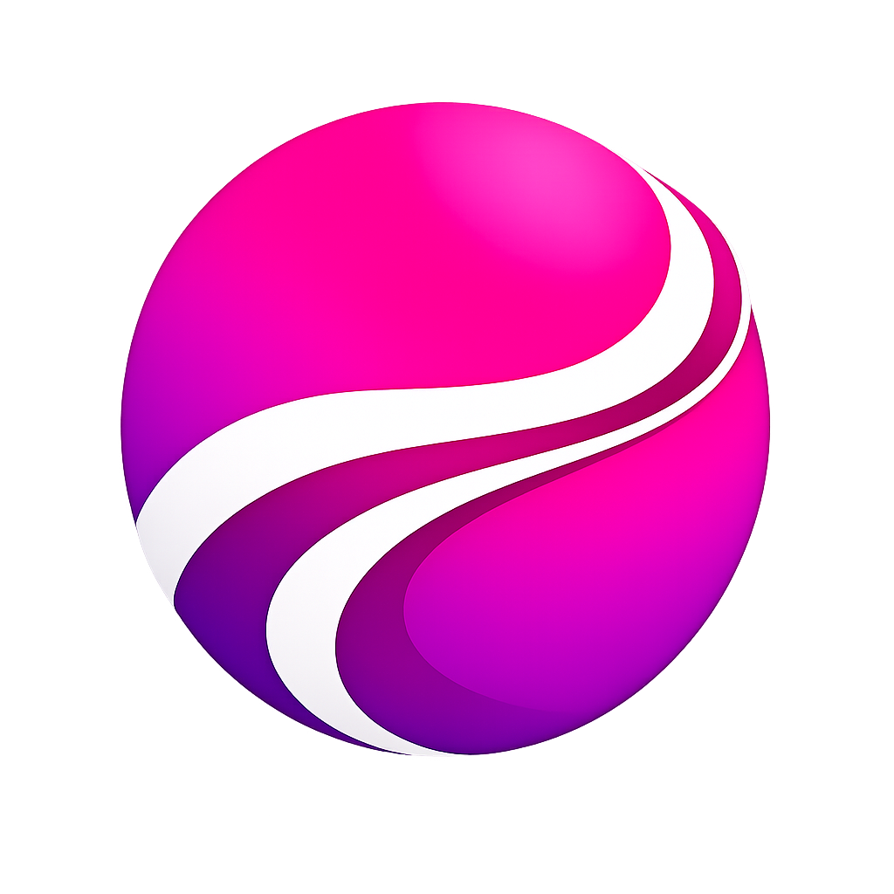
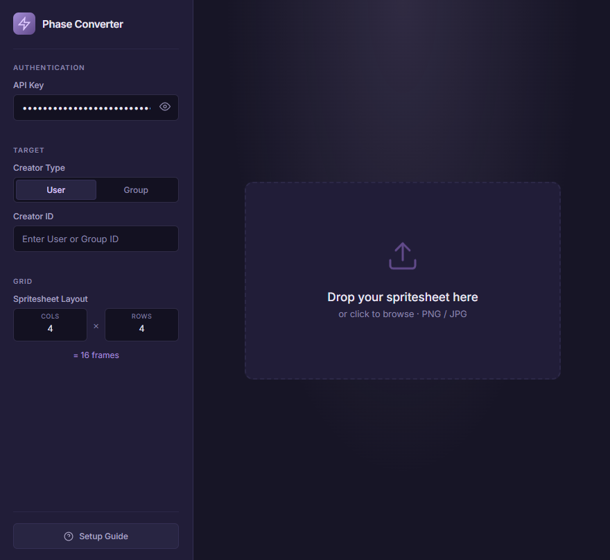
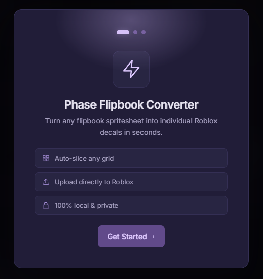

<div align="center">
  
  <h1>Phase VFX Flipbook Converter</h1>
  <p><b>The ultimate companion app for Phase VFX. Seamlessly slice, upload, and import frames directly into your Roblox Studio VFX library.</b></p>

  [](https://opensource.org/licenses/MIT)
  [](https://create.roblox.com/store/asset/78798609925417/Phase-VFX)
</div>

<br>

Welcome to the **Phase VFX Flipbook Converter**! This lightweight desktop tool connects with Roblox's Open Cloud API to securely upload large spritesheets directly into your Roblox inventory. It automatically slices your massive flipbooks into sequential frames and spits out an array of IDs that natively pastes into the Phase VFX plugin. 

<div align="center">
  <br>
  
  <br>
</div>

---

## ⚡ 1-Click Install (Easiest Method)

If you don't want to deal with code, terminal execution, or installing Python, use our pre-compiled standalone versions!

#### 🖥️ For Windows Users
1. Go to the [**Releases Tab**](../../releases) on the right side of this screen.
2. Download **`PhaseConverter.exe`**.
3. Place it wherever you like (Desktop, Documents, etc).
4. Double click it to run! No installation required.

#### 🍎 For Mac Users
1. Go to the [**Releases Tab**](../../releases) on the right side of this screen.
2. Download **`PhaseConverter-Mac.dmg`**.
3. Double click the `.dmg` file to mount it.
4. Drag the PhaseConverter app into your Applications folder!
> *If your Mac raises a security warning on the first opening, simply right-click the Application and hit "Open" instead of double-clicking!*

---

## 🛠️ Source Fallback Installation

If the standalone app isn't working or you wish to run it natively via its python source:
1. Download the `Source code (zip)` from the Releases tab and extract it.
2. Double-click **`Start_Windows.bat`** (Windows) or **`Start_Mac.command`** (MacOS).
> *Both platforms require [Python 3.10+](https://www.python.org/downloads/) to be installed prior to running the fallback script launchers!*

---

## 🚀 How To Use

Using the tool is incredibly straightforward.

### 1. Get an Open Cloud API Key 🔑
1. Go to the [Roblox Creator Dashboard: Credentials](https://create.roblox.com/dashboard/credentials).
2. Click **Create API Key**.
3. Under **Access Permissions**, add the **Assets API** and give it `Write` permissions for `Decals`.
4. Copy the long API Key it gives you into the Converter Box.

### 2. Enter your Target ID 🎯
* **Creator Type:** Are you uploading this for an individual User, or a Group?
* **Creator ID:** Your Roblox User ID or your Group's ID (found in the URL when looking at your profile).

### 3. Slice and Upload ✂️
You have two options to import your spritesheets:

**Option A: Local Image (Drag & Drop)**
Upload your `.PNG` Spritesheet, type in how many Rows and Columns the image has, and hit **Slice & Upload!** 

**Option B: Remote Asset ID (Zero Downloads)**
Found an existing, public spritesheet on Roblox? Just paste the Decal's `Asset ID` directly into the converter, set the Rows and Columns, and hit **Fetch & Slice!** The app will securely download the image directly from Roblox's CDNs, slice it, and instantly republish the 16+ frames directly into your inventory. 

The app securely communicates directly with Roblox and uploads every individual frame as a native Decal to your account. 

### 4. Paste to Phase VFX! 🪄
Once finished, the app will give you a neat little `[ Copy IDs ]` button. Click it, go to Roblox Studio, click the **Importer Tab** inside Phase VFX, and paste! All of your frames will instantly categorize themselves into your personal flipbook library! 

<div align="center">
  <br>
  
  <br>
</div>

---

## 💻 Developer Installation

If you prefer using your terminal or want to contribute to the code, simply run:

```bash
# Clone the Repo
git clone https://github.com/aaronaalmendarez/Phase-VFX-Converter.git
cd Phase-VFX-Converter

# Install Requirements
pip install eel pillow requests

# Run
python app.py
```

### Compiling to an Executable (\`.exe\` / \`.app\`)
If you want to bake the application into a single executable that you can move around like a real program:
```bash
pip install pyinstaller
python -m eel app.py web --onefile --noconsole --name "PhaseConverter" --icon NONE
```

---
<div align="center">
  <sub>Developed natively for the Phase VFX Ecosystem across Roblox Studio.</sub>
</div>
